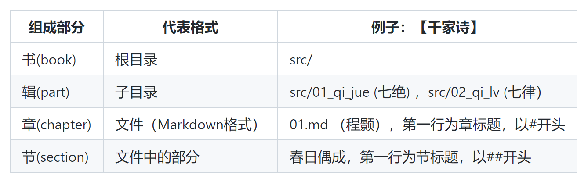
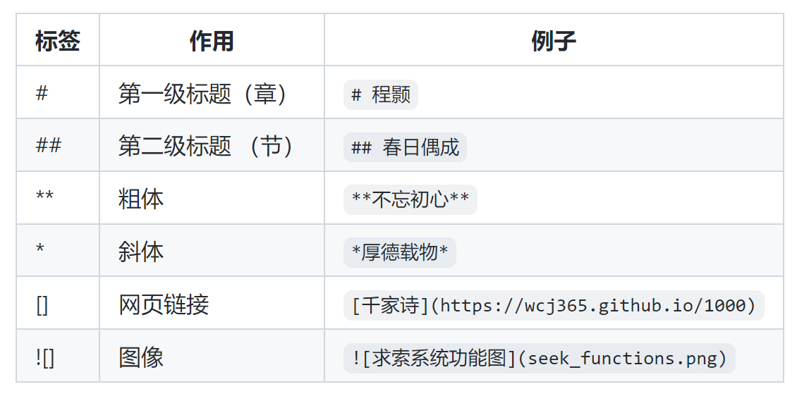

# 求索电子出版系统

求索（SEEK）由王超杰博士独立开发，其英文全称是`Simply Elegant Electronic Knowledge System`，简写为SEEK。
求索即可以用来为个人出版电子书籍，也可以用来为组织管理电子档案。
它的主要特点是操作简易，原始文档和生成版本都适合永久保存并，以多种方式灵活分享。

本系统是对Jupyter Book（网站生成系统）及Pandoc（文档转换系统）的无缝整合。
它利用Jupyter Book生成网站供在线阅读，并利用Pandoc生成pdf和epub版本供线下阅读。
pdf版本适用于打印阅读。epub版本适用于在平板电脑上用电子书阅读器阅读。

求索电子书的原始文档采用Markdown格式。Markdown格式和字处理软件不同，它简单容易， 在桌面（desktop）
上或终端（terminal）上用文本编辑器（text editor）即可编辑。因为不依赖任何字处理软件， 
它更适合文档的永久保存。使用字处理软件生成的文档，因为字处理软件会不断更新并最终过时或消失不利于永久保存。
本系统所生成的网站是静态的基于HTML的网页，它和pdf及epub版本都比字处理软件更适合永久保存。

应用例子可以参照：

- [千家诗](https://wcj365.github.io/1000)
- [乡愁永酒诗文集](https://www.wcj365.xyz)

## （一）系统功能


## （二）书的结构

如下表所示，一本书可以包括几个辑，每一辑包含几个章，每一章包含几个节。
电子书以一章为存储单位，每一章的内容存在一个独立的文本。
属于同一辑的章放在同一个子目录。没一个辑都有自己的一个子目录。
子目录所属的根目录代表一本书。



## （三）目录及文本命名规则

代表辑的子目录和代表章的文本，名字都要以两位数字开头。数字大小决定各个辑，各个章在书中的顺序。
比如，以下下就是【千家诗】的结构和顺序：

- 第一辑 七绝 (src/01_qi_jue)
  - 第一章 程颢 (src/01_qi_jue/01.md)
    - 第一节 【春日偶成】
  - 第二章 朱熹 (src/01_qi_jue/02.md)
    - 第一节【春日】
    - 第二节【题榴花】
- 第二辑 七律 (src/02_qi_lv)
- 第三辑 五绝 (src/03_wu_jue)
- 第四辑 五律 (src/04_wu_lv)

## （四）常用Markdown标签




## （五）使用过程

1. 初始化 (仅执行一次)
  - `$ setup.sh`
2. 只生成网站 
  - `$ . jupyterbook.sh`
3. 只生成pdf和epub格式
  - `$ . pandoc.sh`
4. 同时生成网站和pdf及epub格式 
  - `$ . buildall.sh`

## （六）其他要素

### 1. 如何修改改网站字体大小？

在根目录下，有个子目录`_static`。在下面有一个文本 `my_style.css`。文本内容如下：

```css
p {
    text-align: left;
    font-size: 1.25em; 
}
```

调整`font-size: 1.25em; `数字即可。数字越大，字体越大。

### 2. 如何pdf和epub字体大小？

修改根目录下的`_pandoc.md`文件。字体可以是14或17。

### 3. 如何修改书名和作者？

修改根目录下的`_pandoc.md`文件。

## （七）参考资料

https://scastiel.dev/posts/2021-01-21-how-i-use-pandoc-to-create-my-programming-ebooks/

https://github.com/keevol/pandoc_md_book_starter

http://www.atdevin.com/3582.html

https://jdhao.github.io/2017/12/10/pandoc-markdown-with-chinese/

https://www.overleaf.com/learn/latex/XeLaTeX


